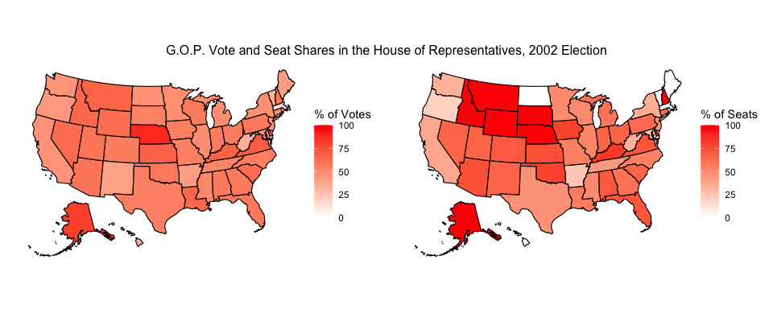
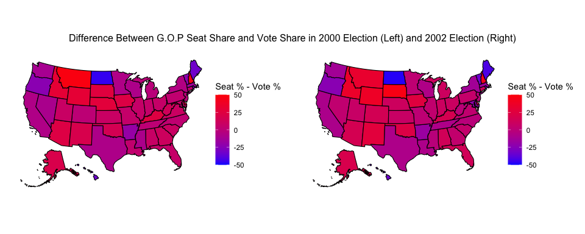

# Blog Post One: Visualizing the Effects of Gerrymandering

### September 15, 2022

[Back to Homepage](../../README.md)

[View the Code](https://github.com/jrdelgado2018/GOV1347/blob/master/blogs/blog1/Blog%20One.Rmd)

## Introduction

Hello! Welcome to my first weekly blog entry. This series will present
statistical models that describe and predict the 2022 congressional
midterm elections. This first entry, though, will present a few
visualizations that draw insight into the effect of gerrymandering on
elections in the early 2000s.

Gerrymandering – the creation of voting districts whose geographies give
one party an electoral advantage over the other [(see this explanation for more)](https://www.washingtonpost.com/news/wonk/wp/2015/03/01/this-is-the-best-explanation-of-gerrymandering-you-will-ever-see/) –
has been a salient topic both in the political discussion and in our
nation’s courts. Both political parties have utilized this tactic - it
seems that the most recent round of redistricting has [benefited the
Democrats](https://www.vox.com/22961590/redistricting-gerrymandering-house-2022-midterms), but in previous decades the [Republicans have tended to
benefit more](https://www.nbcnews.com/news/us-news/partisan-gerrymandering-has-benefited-gop-analysis-shows-n776436). To investigate the effects of gerrymandering, we can
compare the vote share (the percent of votes that one party receives) to
the seat share (the percent of seats in Congress that the party ends up
holding) in an election. If a party receives (proportionally) more seats than votes, it
has benefited from gerrymandering; if it receives fewer seats than
votes, it has suffered from gerrymandering; and if the two percentages
are roughly equal, then the electoral districts are roughly
representative of the population.

## The 2002 Midterm Election

The election we will primarily investigate in this blog post is the 2002
midterm election. This election is interesting because in a typical
midterm, the party of the incumbent president tends to lose seats in the
House of Representatives. In 2002, however, President Bush was extremely
popular (due to his handling of the September 11th terrorist attacks),
and his Republican Party actually gained 7 seats in the House. 2002,
however, was also the first election year after congressional districts
were redrawn following the 2000 census. So, we might ask the question:
did Republicans have such an atypical gain in the House completely
because of President Bush’s popularity, or did gerrymandering have
something to do with it?

To answer this question, we will use data on the votes and seats won
in the 2002 election in each state, curated by the Harvard Kennedy School. 
The data can be found [here.](https://guides.library.harvard.edu/hks/campaigns_elections) Slight adjustments were made to the data
to re-code the congresspeople who are technically independents but reliably
caucus with one of the major parties (Bernie Sanders, for example).

Nationally, Republicans won 229 of the 435 seats in the House of
Representatives, or roughly 52.6%. As the nationwide Republican vote
share (among those ballots that voted for one of the two major parties)
was roughly 52.4%, it seems that this election was actually pretty
representative of the country’s tastes. Let’s examine state-by-state, to
see if we can find anything interesting. Below is a comparison of the
vote share by state (on the left) and the seat share by state (on the
right) that the Republicans attained in this election. Both maps use the
same color scale, where a “hotter” shade of red corresponds to a larger
percent. So, if there are many states that are “hotter” on one map than
on the other, we might conclude that gerrymandering either helped or
hurt the Republicans (depending on which map is “hotter”).

There certainly appear to be more states whose G.O.P. seat shares are
“hotter” than the corresponding G.O.P. vote shares. We see this across
the west, midwest, and south. So, why are the nationwide seat and vote
percentages so close? Well, there are a smaller number of states, mostly
located in the northeast, where the Democrats won many more seats than
votes. These states tended to be larger (for example, New York,
Massachusetts, and Maryland), which offset the effects of Republicans
winning many more seats than votes in more, but smaller states.

## Comparing to the 2000 Election

Based on that pair of visualizations, we might conclude that the effect
of gerrymandering after the 2000 census was somewhat minimal. While
electoral maps favored Republicans in more states than Democrats, the
states in which Democrats were favored tended to be larger. This
resulted in an overall balance between the two parties. To see if the
redrawn maps had much of an impact at all, we might compare the 2002
election to the 2000 election, the last election that used the district
maps from before the 2000 census. In this election, Republicans
maintained control of the House (though did not significantly increase
the number of seats held). They won 222 of the 435 possible seats
(roughly 51%) despite only taking roughly 50% of the vote. Those
percentages are again pretty close, indicating the the election was
fairly representative of the country’s preferences. Below is a
comparison of the difference between the seat share and the vote share in
each election, with 2000 on the left and 2002 on the right. Both maps
use the same color scale, where blue indicates Republicans winning far
fewer seats than votes and red indicates Republicans winning far more
seats than votes.

These two maps are almost identical! There are a few states in the west
that got redder, and a few states in the northeast that got bluer, but
overall most states remain a similar shade of purple between the two
years. From this, we might conclude that the redrawing of congressional
districts following the 2000 census did not disproportionately benefit
either party, as compared to the existing maps. 

The implication of all
this is that we can answer the question we set out to answer.
Republicans did so well in the 2002 midterms not because they simply
took advantage of gerrymandering to win proportionally more seats than
votes. There is not very much evidence to support that claim. Rather, it
appears that their atypically increasing majority in the House was
reflective of the country’s preferences at that time. 
