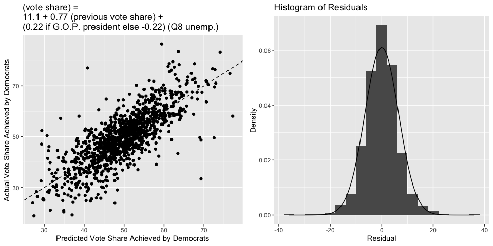

# Blog Post Two: Using the Economy to Make Predictions

### September 19, 2022

[Back to Homepage](../../README.md)

[View the
Code](https://github.com/jrdelgado2018/GOV1347/blob/master/blogs/blog2/Blog%20Two.Rmd)

## Introduction

It is well-established that in presidential elections, the recent state
of the economy is a strong predictor of the national vote share.
However, in preliminary analyses, a model using the most recent
quarter’s GDP change to predict the nationwide popular vote share in
congressional elections was shown not to be very powerful. How might we
attempt to bridge the gap between these two results? Well, perhaps when
considering the election of their representative in Congress, voters do
not consider the United States’ economy at large; rather, they consider
a more localized measure of economic performance. This would make sense,
because Congressional representatives are tasked to specifically
advocate for their constituents, so the implication of this model is
that voters are holding representatives accountable only to their job
description. Let’s see how well this model, and extensions of it,
perform.

## Using Statewide Unemployment to Predict Statewide Vote Share

The base model that this blog post will consider uses the statewide
unemployment rate to predict the vote share achieved by Democrats in
that state. We consider the vote share achieved by Democrats in this
model because, as is described in this paper by \_\_\_\_, voters tend to
think about the economy as an issue that Democrats “own,” as opposed to
a metric upon which the incumbent should be either rewarded or punished.
In calculating the vote share, we consider only those ballots that were
cast for one of the two major parties. We also do not consider those
elections in which a third party won more than 10% of the popular vote,
as they might obscure the dynamic we are attempting to uncover between
the two major political parties.

Below are scatterplots for two variations of this model. The scatterplot
on the left uses the percent change in the unemployment rate between Q7
and Q8 as the independent variable, whereas the scatterplot on the right
uses the Q8 unemployment rate as the independent variable. Both
scatterplots include dashed lines at the median values for each variable
(to get our bearings around the plots), and the fitted regression lines
with shaded 95% prediction intervals. Both plots exhibit a very, very
weak positive correlation. This does technically agree with the model
that Democrats tend to gain votes when unemployment is high because they
“own” the issue, but the correlations are tiny (both less than 0.2), and
it also seems that the presence of outlier points “carry” the
correlations. The majority of the data in both plots is concentrated in
the middle, and there is a very large variation in the vote share
achieved by Democrats for any fixed unemployment rate change. So,
neither model is very good. One interesting thing is that voters seem to
react more to the unemployment level at the time of the election than to
the percent change from the previous quarter. This is indicated by both
a higher R-squared (0.015 vs. 0.0026) and a higher slope t-statistic
(4.2 vs. 1.7) for the right regression vs. the left regression. The
implication is that voters perhaps only care if unemployment is
currently high, regardless of if it used to be much higher or much
lower.

The problem with these models is that obviously unemployment alone won’t
explain the vote share that went to Democrats in every state, because
some states have more liberal constituencies than others. It may be the
case that above average unemployment does cause above average votes to
Democrats, but each state has a different calibration of what the
“average” vote share to Democrats would be. In the base model, we are
comparing apples to oranges.

## Incorporating State Heterogeneity and the President

We will now consider an improved model, one which takes that factor into
account. We will consider the statewide vote share for Democrats in the
previous election, which gives a good indication of how liberal or
conservative the state is. We will also consider the structural effect
that the party of the sitting president has on the congressional
election, as congressional elections are often seen as a referendum on
the performance of the president. We will allow the party of the sitting
president interact with the Q8 unemployment rate in our model. This
essentially gives the line a different slope when the sitting president
is a Democrat, in line with \_\_\_\_’s findings that voters
reward/punish politicians for unemployment differently depending on
whether a Democrat is in office.

Below is a scatterplot that compares the predicted vote share to the
actual vote share, and a dashed line indicating where the two would be
equal. Clearly, the fit of this model is much better than before - the
R-squared jumps to over 0.6, indicating that just over 60% of the
observed variation in the vote share for Democrats can be explained by
this regression model. Moreover, below is also a histogram of the
residuals of this model. The overlayed curve is a Normal density curve,
revealing that the residuals are indeed approximately Normal and our
prediction intervals and standard error estimates are statistically
valid.

This model is certainly an improvement to the model from before, and is
also an improvement to the model that simply used national measures of
economic performance, but it is far from perfect. The standard deviation
of the residuals is 6.54, and this agrees with a bootstrapped
cross-validation estimate of the root mean squared error of this model
(which is 6.55). So, a typical deviation between this model’s prediction
and the actual vote share achieved by Democrats is around 6.5%, which is
certainly enough to flip the tide of an election. Moreover, the
coefficient for unemployment in the model has a magnitude of around 0.2.
So, an unemployment of 10% (which is pretty high) will only swing the
predicted vote share of Democrats by around 2%. This isn’t negligible,
but it is certainly less than the variation we see. So, the local
economy still isn’t as strong of a predictor of election outcomes as
we’d perhaps like it to be.

## 2022 Prediction

Below is a map that summarizes this model’s prediction of the 2022
election, using the most current available unemployment data (May 2022).
South Dakota does not have a prediction because there is no Democrat
running in the state. A color closer to blue corresponds to a larger
vote share for Democrats, and a color closer to white corresponds to a
smaller vote share for Democrats. Below is also a table that gives a 95%
prediction interval for each state.

    ##             state LowerBound Predicted UpperBound
    ## 1         Alabama       20.7      33.6       46.5
    ## 2          Alaska       32.1      44.9       57.8
    ## 3         Arizona       35.8      48.6       61.5
    ## 4        Arkansas       25.1      37.9       50.8
    ## 5      California       44.8      57.7       70.5
    ## 6        Colorado       39.6      52.5       65.3
    ## 7     Connecticut       44.0      56.9       69.7
    ## 8        Delaware       42.5      55.3       68.2
    ## 9         Florida       35.1      48.0       60.8
    ## 10        Georgia       35.2      48.1       60.9
    ## 11         Hawaii       50.7      63.6       76.5
    ## 12          Idaho       21.7      34.5       47.4
    ## 13       Illinois       40.8      53.6       66.5
    ## 14        Indiana       29.0      41.9       54.7
    ## 15           Iowa       33.7      46.6       59.4
    ## 16         Kansas       29.8      42.7       55.5
    ## 17       Kentucky       24.3      37.1       50.0
    ## 18      Louisiana       18.1      31.0       43.9
    ## 19          Maine       42.0      54.9       67.7
    ## 20       Maryland       47.3      60.2       73.0
    ## 21  Massachusetts       47.9      60.7       73.6
    ## 22       Michigan       36.2      49.0       61.9
    ## 23      Minnesota       37.2      50.1       62.9
    ## 24    Mississippi       30.6      43.5       56.3
    ## 25       Missouri       28.6      41.5       54.3
    ## 26        Montana       31.2      44.0       56.9
    ## 27       Nebraska       25.3      38.1       51.0
    ## 28         Nevada       36.5      49.3       62.2
    ## 29  New Hampshire       39.2      52.0       64.9
    ## 30     New Jersey       41.9      54.7       67.6
    ## 31     New Mexico       39.2      52.1       64.9
    ## 32       New York       44.0      56.9       69.7
    ## 33 North Carolina       33.5      46.3       59.1
    ## 34   North Dakota       19.5      32.4       45.3
    ## 35           Ohio       31.0      43.8       56.7
    ## 36       Oklahoma       21.6      34.5       47.4
    ## 37         Oregon       41.3      54.1       67.0
    ## 38   Pennsylvania       35.1      48.0       60.8
    ## 39   Rhode Island       42.4      55.3       68.1
    ## 40 South Carolina       30.7      43.6       56.4
    ## 41      Tennessee       23.3      36.2       49.0
    ## 42          Texas       32.0      44.9       57.7
    ## 43           Utah       25.9      38.8       51.7
    ## 44        Vermont       52.5      65.4       78.3
    ## 45       Virginia       40.5      53.4       66.2
    ## 46     Washington       41.2      54.0       66.9
    ## 47  West Virginia       22.3      35.2       48.1
    ## 48      Wisconsin       34.9      47.7       60.6
    ## 49        Wyoming       17.7      30.6       43.5
