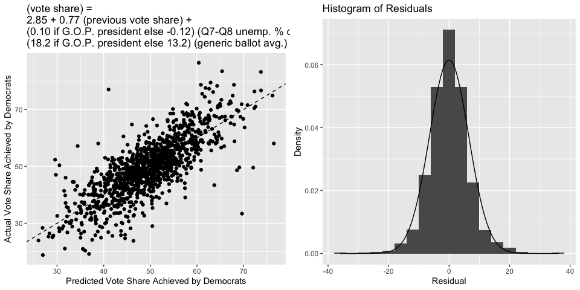
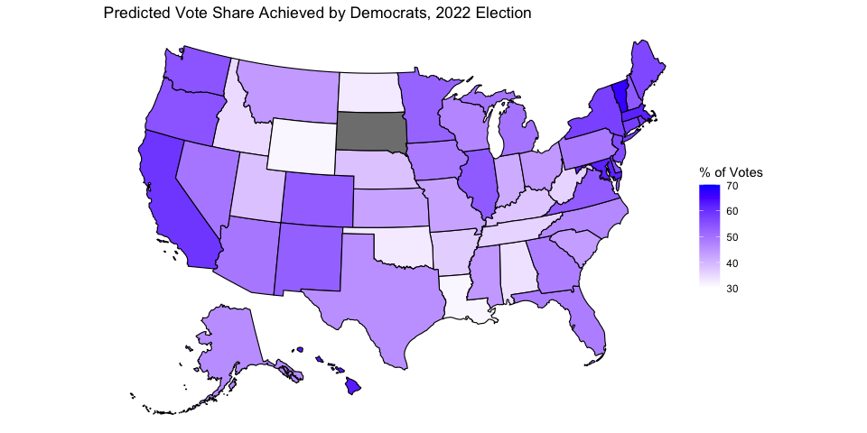

# Blog Post Three: Polls

### September 19, 2022

[Back to Homepage](../../README.md)

[View the
Code](https://github.com/jrdelgado2018/GOV1347/blob/master/blogs/blog3/Blog%20Three.Rmd)

## The Economist’s and FiveThirtyEight’s Approaches

In this blog post, I will summarize the modeling approaches taken by two
major political forecasters, The Economist and FiveThirtyEight. I will
compare and contrast the two approaches, ultimately expressing a slight
preference for FiveThirtyEight’s methodology, and will then update my
predictive model using a couple of insights from both groups.

### The Economist

In a nutshell, [The Economist's model](https://www.economist.com/graphic-detail/2018/05/24/introducing-our-prediction-model-for-americas-mid-term-elections?utm_medium=cpc.adword.pd&utm_source=google&ppccampaignID=17210591673&ppcadID=&utm_campaign=a.22brand_pmax&utm_content=conversion.direct-response.anonymous&gclid=Cj0KCQjw1bqZBhDXARIsANTjCPLmClpV2iWBRHwk8na9pefa5DFt58js24RFO3LYhMP5Ns3eSJc-i3MaAhYsEALw_wcB&gclsrc=aw.ds) approaches their prediction task in a two
step process. The first step is to estimate the overarching national
political sentiment - the nationwide popular vote shares that will be
achieved by Democrats and Republicans. They use polling to inform this
estimate. The primary source is the generic ballot poll, but they also
consider polls of the president’s popularity (theorizing that a very
popular president will tend to help their party’s congressional
candidates, and vice versa). They adjust the estimates provided by the
polls with such factors as the presence of uncontested seats, the degree
of political polarization, and “fundamental” factors like the state of
the economy and whether the election is a midterm.

In the second stage, The Economist uses this nationwide vote share
forecast to individually predict each district. The idea is to use
historical election data in that district to see how it tends to deviate
from the national baseline. In addition to the raw historical vote
shares, The Economist considers the presence of swing voters in the
district, and structural factors like whether an incumbent is running,
how much they’ve raised, and where they fall ideologically. Instead of
making a point estimate from these factors, The Economist fits a skew-T
distribution for each district, attempting to capture not just the most
likely outcome but also the extreme events that might occur. With these
distributions fitted, they make their final seat forecasts based on the
proportion of seats won for each party in 10,000 simulations of the
election.

### FiveThirtyEight

[This model](https://fivethirtyeight.com/methodology/how-fivethirtyeights-house-and-senate-models-work/) predicts the midterm election in one step. The primary tool
for this prediction is polling - and FiveThirtyEight uses pretty much
any poll that they can get their hands on, as long as it comes from a
professional source. Reflecting [Galton’s observation](https://www.nature.com/articles/075450a0) that an aggregation
of many guesses will tend to outperform one single guess,
FiveThirtyEight takes great care to weight each poll appropriately.
Weighting factors include how recently the poll was taken, the
demographic of the poll (registered voters vs. likely voters), and the
track record of the specific pollster. However, every single district
will not have a poll dedicated to it, since only the most
contested/followed/“interesting” ones will. So, FiveThirtyEight employs
a k-nearest neighbors algorithm to predict what a hypothetical poll
would say about an unpolled district, keeping in mind the selection bias
of polls only being conducted in the more salient districts.

In addition to the polls, this model includes a diverse variety of
fundamental variables that are known to impact the outcomes of
elections. FiveThirtyEight includes on this list such factors as
incumbency status, the margin of victory for the incumbent in the
previous election, the generic ballot poll (as a measure of the national
sentiment), campaign funds raised, the performance of the district in
previous presidential and state legislative elections, and the political
experience of the challenger. In races for open seats, only the relevant
factors (so, those that do not relate to an incumbent) are included. One
version of the FiveThirtyEight predictor even uses the ratings (“toss
up”, “leans Democrat”, etc.) that historically accurate political
experts have assigned each district. With all this in mind,
FiveThirtyEight simulates many runs of the election, taking special care
to model the correlation structure of the districts, to make its final
prediction.

### Comparing the Methods

The most obvious difference between the two methods is their overall
structure. The Economist predicts a national trend and each district’s
subsequent deviations from that trend, while FiveThirtyEight focuses
exclusively on the idiosyncracies of each district. Within that
structure, the models have many similarities in terms of the included
variables. Both models include the fundamental factors that reflect the
effect of structure on congressional elections - incumbency status,
fundraising, whether it’s a midterm, and so on. The one notable
difference in fundamentals is that The Economist includes the state of
the economy (as indicated by the unemployment rate), while
FiveThirtyEight does not include this (though, one might argue that it’s
inclusion of Congress’s approval rating is relatively correlated to the
state of the economy).

In terms of included variables, the major difference between the models
lies not in the fundamentals but in the poll data. The Economist relies
mostly on the generic ballot poll, while FiveThirtyEight uses a much
wider variety of more specific polls (including the generic ballot poll
in the fundamentals category as a representation of national sentiment).
The reason for this difference is the reality that most individual
districts will not have a poll targeted to it; the two forecasters just
solve this problem with different methods. FiveThirtyEight applies
k-nearest neighbors prediction to carefully-weighted averages of nearby
polls, whereas The Economist instead ignores district-level polling and
uses polls to predict a national baseline from which districts deviate
in predictable ways.

Both forecasters take care to avoid giving too much weight to a single
point estimate, but they again go about achieving this goal in different
ways. The Economist uses elastic-net regularization to avoid large model
coefficients that overfit the data, and then estimate a skew-T
distribution (notorious for flexible shape and fat tails) for each
district in order to adequately predict extreme events (making no
mention of correlation between districts). FiveThirtyEight, on the other
hand, makes no mention of regularization to scale down fitted
coefficients, but they take great care to model the correlation
structure between the error of each district’s estimate (taking into
account four categories that describe how polls and fundamentals might
over/understate certain factors across multiple districts). Both
FiveThirtyEight and The Economist use simulation to reach their final
predictions, most likely because the probability calculations required
to find an analytic distribution would be intractable.

Both models obviously include a lot of thought, and were crafted by
experienced data scientists. However, I believe FiveThirtyEight’s
methodology to be slightly better, for two reasons. Firstly, while
deviations from a national baseline is certainly a logical framework for
this prediction task, it introduces two possible sources of error in the
model: error in predicting the national vote share, and error in
translating the national vote share to district vote shares. These
errors might compound on each other in an “unlucky” realization of the
election, so I marginally prefer FiveThirtyEight’s single-stage model,
with only one prediction step in which an error could be made. Secondly,
The Economist provided no justification for their assumption that each
district follows a skew-T distribution, and it is well-known to be more
difficult to learn an entire distribution than to learn a single
parameter. So, while a fat-tailed and skewed distribution certainly
makes sense, I again have a marginal preference for FiveThirtyEight’s
approach of modeling the correlation structure between districts instead
of the distributions of independent districts (especially considering
the [correlated polling errors we saw in 2016!](https://fivethirtyeight.com/features/election-update-why-our-model-is-more-bullish-than-others-on-trump/)). Again, though, I find
both forecasts to be incredibly impressive.

## 2022 Forecast Update

In line with the FiveThirtyEight model, I update my model (that predicts
vote share on a state-by-state level) to include the generic ballot
poll. In accordance with the “wisdom of crowds” logic, I take a simple
average of all generic ballot polls conducted within two months of the
election - though, in the future, I would like to consider my weighting
more carefully, as FiveThirtyEight does. For each poll average, I
calculate the two-party vote share that would go to the Democrats. I
also allow the presence of a Democrat in office to interact with the
generic poll results, as voters might respond more favorably to
Democrats if they are popular and a Republican president is in office.

Interestingly, in this model, the economic variable that becomes more
significant is the Q7-Q8 percent change in unemployment rate, not simply
the Q8 unemployment rate. [Last week](../../blogs/blog2/Blog-Two.md), I concluded that voters tend to
respond more to the absolute Q8 rate, so does this finding contradict
that? It’s not quite that simple. Last week’s model isolated the effect
of unemployment on voter choice, but this week’s model includes another
variable (national sentiment via generic ballot) in the equation. So, an
interpretation could be that once national sentiment is accounted for,
voters respond more to the change in unemployment (perhaps because
national sentiment is responsive to the overall level of unemployment).

Or, perhaps this just happened due to random chance. The coefficient on
unemployment is significant, but still low - on the same order as it was
last week. So, it might be the case that in this new model, since the
effect of unemployment is relatively low in magnitude, the inclusion of
a new covariate caused the percent change to become more significant due
to pure chance. Indeed, the overall model is not very much improved from
last week - the R-squared jumped by just around 1%, but the bootstrapped
estimate of the root-mean squared decreases only to 6.51. In the future,
the model might be improved by calibrating each state’s sensitivity to
the national generic ballot poll separately (as, some states swing more
than others), and by looking into district-level polls in addition to
the generic ballot (as FiveThirtyEight does).

The two figures below include a scatterplot of the actual vote share to
Democrats (each point is one state in one year) versus the predicted
vote share. The fit looks pretty similar to last week’s fit (for
reference, the dashed line indicates where the actual value would equal
the predicted). On the right is a histogram of the residuals, with a
Normal density overlayed. Again, the residuals appear normal, justifying
our statistical inferences about this model.

Below is a map that summarizes the point estimates of this model’s
prediction of the 2022 election, using the most current available
unemployment data and generic poll data. South Dakota again does not
have a prediction because there is no Democrat running in the state. A
color closer to blue corresponds to a larger vote share for Democrats,
and a color closer to white corresponds to a smaller vote share for
Democrats. Below is also a table that gives a 95% prediction interval
for each state.

    ##             state LowerBound Predicted UpperBound
    ## 1         Alabama       21.1      33.9       46.7
    ## 2          Alaska       32.9      45.8       58.6
    ## 3         Arizona       36.3      49.1       61.9
    ## 4        Arkansas       23.9      36.7       49.5
    ## 5      California       46.3      59.3       72.3
    ## 6        Colorado       40.3      53.2       66.0
    ## 7     Connecticut       45.0      57.9       70.8
    ## 8        Delaware       42.2      55.0       67.7
    ## 9         Florida       35.4      48.2       61.0
    ## 10        Georgia       35.1      47.9       60.7
    ## 11         Hawaii       50.1      62.9       75.6
    ## 12          Idaho       22.0      34.9       47.7
    ## 13       Illinois       40.8      53.6       66.3
    ## 14        Indiana       28.6      41.3       54.1
    ## 15           Iowa       35.3      48.4       61.5
    ## 16         Kansas       29.8      42.6       55.4
    ## 17       Kentucky       24.8      37.6       50.4
    ## 18      Louisiana       18.4      31.2       44.0
    ## 19          Maine       43.4      56.4       69.5
    ## 20       Maryland       48.8      61.8       74.9
    ## 21  Massachusetts       49.1      62.0       75.0
    ## 22       Michigan       36.7      49.4       62.2
    ## 23      Minnesota       38.8      52.1       65.3
    ## 24    Mississippi       31.3      44.1       57.0
    ## 25       Missouri       29.6      42.6       55.5
    ## 26        Montana       31.2      43.9       56.7
    ## 27       Nebraska       25.4      38.2       51.0
    ## 28         Nevada       36.6      49.3       62.0
    ## 29  New Hampshire       40.5      53.6       66.7
    ## 30     New Jersey       42.9      55.8       68.7
    ## 31     New Mexico       39.9      52.7       65.5
    ## 32       New York       44.7      57.5       70.3
    ## 33 North Carolina       33.7      46.5       59.2
    ## 34   North Dakota       19.9      32.7       45.6
    ## 35           Ohio       31.2      44.0       56.8
    ## 36       Oklahoma       19.8      32.6       45.5
    ## 37         Oregon       41.7      54.5       67.3
    ## 38   Pennsylvania       35.8      48.6       61.4
    ## 39   Rhode Island       44.2      57.4       70.7
    ## 40 South Carolina       30.7      43.4       56.2
    ## 41      Tennessee       22.9      35.7       48.5
    ## 42          Texas       32.7      45.5       58.4
    ## 43           Utah       25.5      38.3       51.0
    ## 44        Vermont       53.7      66.8       79.8
    ## 45       Virginia       40.4      53.2       66.0
    ## 46     Washington       41.6      54.4       67.2
    ## 47  West Virginia       22.9      35.7       48.5
    ## 48      Wisconsin       34.0      46.8       59.5
    ## 49        Wyoming       18.3      31.2       44.0
