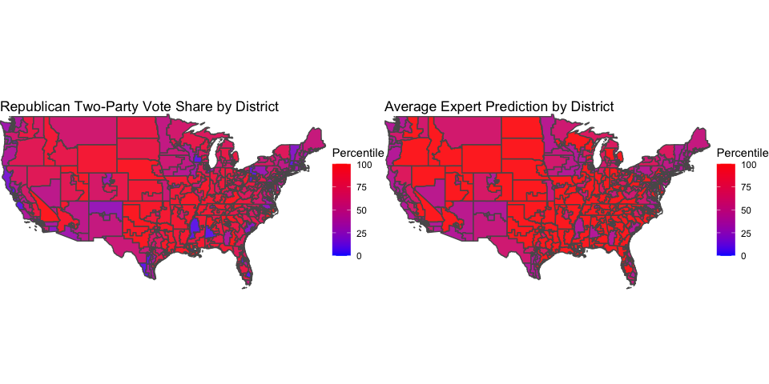
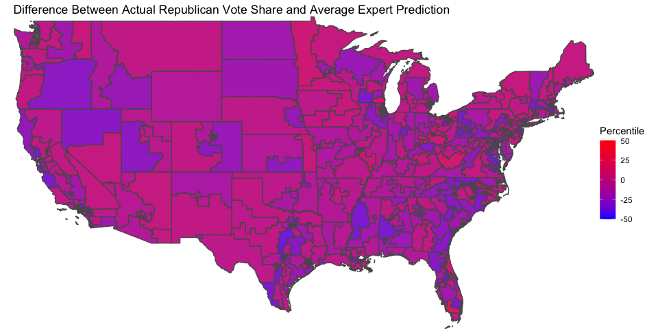
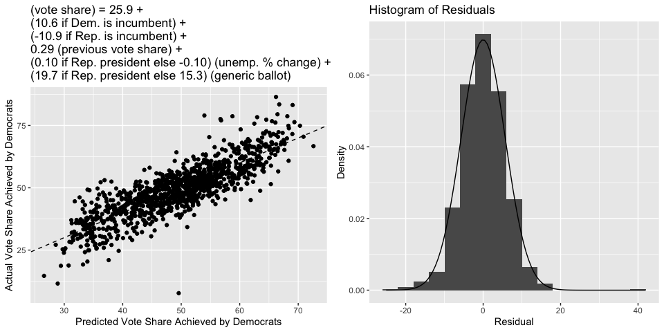
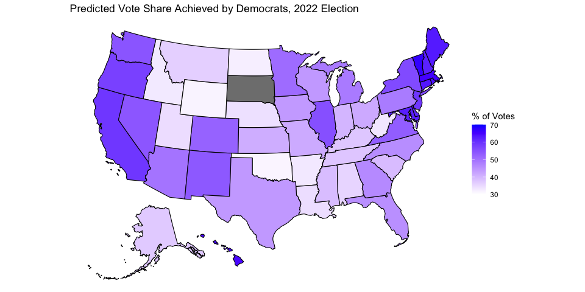

# Blog Post Four: Expert Predictions and Fundamentals

### October 3, 2022

[Back to Homepage](../../README.md)

[View the
Code](https://github.com/jrdelgado2018/GOV1347/blob/master/blogs/blog4/Blog%20Four.Rmd)

## Expert Ratings

In this blog post, I will compare the results of the 2018 midterm
elections to the ratings that political experts assigned to each
district. The political forecasters I examine are [The Cook Political
Report](https://www.cookpolitical.com/ratings/house-race-ratings),
[Sabato’s Crystal
Ball](https://centerforpolitics.org/crystalball/2022-house/), and
[Inside Elections](https://insideelections.com/ratings/house), since
these three made a forecast for all 435 congressional districts and the
data is accessible on [Ballotpedia](https://ballotpedia.org/Main_Page).

Each forecaster assigns each district a categorical rating from a set of
seven ratings - the district can be “solid”/“safe”, “likely”, or “lean”
towards one party, or the district can be a “toss up” between the two
parties. These ratings had to be transformed to a numeric scale so that
they could be compared to measurable election outcomes, so I assigned
each rating a number from 1 to 7 (where 1 is “solid/safe Democrat”, 7 is
“solid/safe Republican”, and 4 is “toss up”).

The goal is to compare these expert predictions to the election outcome
(I used Republican two-party vote share; there was negligible difference
when Republican vote margin was used instead), but the two variables are
currently on different scales. Vote share (when measured as a percent)
takes on values from 0 to 100, whereas the expert ratings as I’ve
defined them take on values from 1 to 7. To put these variables on the
same scale, I calculated the percentile of each observation (which is
the percent of other observations that are lower). I considered simply
assigning a vote share to each expert categorical rating (perhaps a 4
corresponds to a prediction of 50% for Republicans, a 5 corresponds to a
prediction of 52% for Republicans, and so on), but the problem is that
the experts make their ratings in accordance with the (predicted)
probability of the Republican winning the seat. And while correlated,
win probabilities do not map nicely onto vote shares, so I did not want
to implicitly assume that they do. So, I opted to use this normalization
approach to transform both variables into distributions that range from
0 to 100.

The maps below compare the percentile of the Republican vote share (on
the left) to the percentile of the average expert prediction (on the
right) for each district. A redder district is one that was stronger for
the Republicans, and a bluer district is one that was weaker for the
Republicans.

The two maps look pretty similar. Indeed, the correlation between the
percentile of the actual Republican vote share and the percentile of the
average forecaster rating is roughly 0.9, indicating a very strong
relationship between the two. The districts that are purple in the left
map - meaning a vote share around 50% - tend to also be purple in the
right map - meaning an average rating close to a toss-up. The same trend
seems to hold with districts that are very red (meaning very
Republican-favored) in both maps. However, the main differences between
the two maps arise in the districts that are very blue in the left map -
meaning very Democrat-favored. These states tend to be purpler on the
right map, which perhaps means that experts were not as good at
predicting Democrat landslides as they were at predicting Republican
landslides and toss-ups.

This pattern is verified by plotting the difference between the
percentile of the actual Republican vote share and the percentile of the
average expert rating, on the map below.

There are pretty clearly more blueish districts (meaning Democrats did
better than expected) than reddish districts (meaning Republicans did
better than expected). We know that the Democrats did very well in the
2018 midterms, so perhaps all this indicates that they did better than
they were expected to at the time.

This analysis does not change very much if we were to look at any
individual forecaster as opposed to the average of the forecasters.
Inside Elections had predictions that were slightly less accurate (a
correlation of 0.89 with actual vote outcomes), and the other two
forecasters had predictions that were slightly more accurate
(correlations of roughly 0.91 with actual vote outcomes). But the trend
of under-predicting Democrat landslides remained.

## Model Update

This week, I update my forecasting model to include the effects of
incumbency, arguably the most important fundamental in an election. We
saw in [previous weeks the effect of the party of the sitting
president](https://jrdelgado2018.github.io/GOV1347/blogs/blog2/Blog-Two.html),
but this week I will consider the incumbency advantage that a member of
Congress might have.

So, I manipulate the data to include flags for whether each candidate is
an incumbent or not. In line with this week’s videocast’s discussion of
the effect of mean-reversion, I also include a flag for whether it is
the incumbent’s first term in office. The logic here is that a
politician who was just elected to their term was likely elected in a
year in which their party did better than average, so mean reversion
will see them do worse the next year on average.

As before, I aggregate the economic predictor and these new fundamental
variables on the state level, and include national polling through the
generic ballot. Also as before, I allow the presence of a Democrat
president in office interact with the coefficient for unemployment and
generic ballot polling, since we’ve seen [in previous weeks that voters
react differently depending on the party of the
president](https://jrdelgado2018.github.io/GOV1347/blogs/blog3/Blog-Three.html).

Incorporating these new variables into the model raises the R-squared to
0.71, an increase of roughly 0.1 from last week! Moreover, the standard
error of the residual and bootstrapped estimate of the root-mean square
error jump down by almost one point to roughly 5.7, meaning that our
estimates got much more precise.

Interestingly, the variables for whether the incumbent candidate was in
their first term did not prove to be significant. Perhaps this is
because mean reversion is literally baked into the fitted regression
equation (in this context, it’s known as [“regression to the
mean”](https://en.wikipedia.org/wiki/Regression_toward_the_mean#Definition_for_simple_linear_regression_of_data_points)),
so we do not actually have to include variables that are meant to
capture mean reversion.

Below is the usual scatterplot showing predicted vote share versus
actual vote share, as well as the histogram of residuals. We see that
the data points tend to be much closer to the 45-degree line than they
were last week, and that the residuals are once again approximately
Normal (but with a smaller standard deviation than last week).

Below is a map summarizing the current model’s vote share predictions
for each state in the 2022 midterms. I again use the most current
available unemployment and generic ballot data. South Dakota again does
not have a prediction because there is no Democrat running in the state.
A color closer to blue corresponds to a larger vote share for Democrats,
and a color closer to white corresponds to a smaller vote share for
Democrats. Below is also a table that gives a 95% prediction interval
for each state.

    ##             state LowerBound Predicted UpperBound
    ## 1         Alabama       24.3      35.6       46.9
    ## 2          Alaska       25.8      37.1       48.4
    ## 3         Arizona       38.5      49.8       61.1
    ## 4        Arkansas       21.8      33.0       44.3
    ## 5      California       47.6      59.1       70.5
    ## 6        Colorado       40.9      52.3       63.6
    ## 7     Connecticut       52.0      63.4       74.7
    ## 8        Delaware       50.4      61.7       72.9
    ## 9         Florida       34.3      45.6       56.8
    ## 10        Georgia       35.1      46.3       57.5
    ## 11         Hawaii       53.3      64.6       75.8
    ## 12          Idaho       21.6      32.9       44.3
    ## 13       Illinois       44.0      55.3       66.5
    ## 14        Indiana       28.7      39.9       51.1
    ## 15           Iowa       32.4      44.0       55.6
    ## 16         Kansas       29.9      41.1       52.4
    ## 17       Kentucky       26.2      37.5       48.8
    ## 18      Louisiana       23.2      34.5       45.7
    ## 19          Maine       51.5      63.0       74.5
    ## 20       Maryland       50.9      62.4       73.9
    ## 21  Massachusetts       54.0      65.4       76.8
    ## 22       Michigan       37.4      48.6       59.9
    ## 23      Minnesota       39.2      50.9       62.6
    ## 24    Mississippi       27.6      39.0       50.3
    ## 25       Missouri       30.1      41.5       52.9
    ## 26        Montana       25.0      36.3       47.5
    ## 27       Nebraska       22.9      34.1       45.4
    ## 28         Nevada       43.0      54.2       65.5
    ## 29  New Hampshire       50.5      62.1       73.6
    ## 30     New Jersey       47.6      59.0       70.4
    ## 31     New Mexico       42.7      54.0       65.2
    ## 32       New York       44.7      56.0       67.3
    ## 33 North Carolina       34.5      45.7       57.0
    ## 34   North Dakota       20.8      32.1       43.4
    ## 35           Ohio       30.4      41.6       52.9
    ## 36       Oklahoma       20.0      31.3       42.6
    ## 37         Oregon       46.3      57.6       68.9
    ## 38   Pennsylvania       37.2      48.5       59.8
    ## 39   Rhode Island       52.0      63.7       75.3
    ## 40 South Carolina       27.8      39.0       50.3
    ## 41      Tennessee       26.5      37.7       48.9
    ## 42          Texas       32.7      44.0       55.3
    ## 43           Utah       23.3      34.6       45.8
    ## 44        Vermont       55.5      67.0       78.5
    ## 45       Virginia       41.8      53.0       64.3
    ## 46     Washington       43.2      54.5       65.7
    ## 47  West Virginia       21.9      33.2       44.5
    ## 48      Wisconsin       32.8      44.0       55.3
    ## 49        Wyoming       20.2      31.6       42.9
