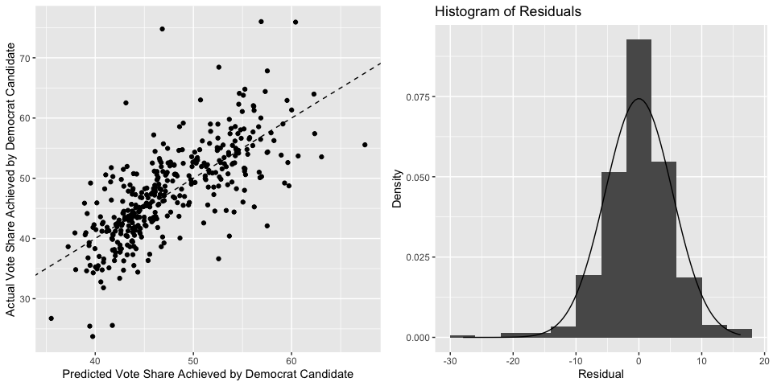

# Blog Post Five: The Air War

### October 11, 2022

[Back to Homepage](../../README.md)

[View the
Code](https://github.com/jrdelgado2018/GOV1347/blob/master/blogs/blog5/Blog%20Five.Rmd)

## Model Update: Part One

This week, I will be updating my model to take “the air war,” campaign
advertising, into account. I will also move from predicting vote share
at the state-level to predicting vote share at the district-level, using
the insights I drew from my state-level models of previous weeks.

Many elements of this model are the same as they were in [last
week’s](https://jrdelgado2018.github.io/GOV1347/blogs/blog4/Blog-Four.html)
model. We again only consider those races in which there is both a
Democrat and a Republican running, and third party candidates acquire
less than 10% of the vote, since other cases obscure the two-party
dynamic we are trying to pick up on. To predict the vote share in each
district, we use the vote share from the previous election to set a
baseline for how liberal or conservative the particular district is. We
include the average of generic ballot poll results within two months of
the election, to see what national sentiment is like; and include flags
for whether the candidate is an incumbent (and what his party is), to
account for the incumbency advantage.

We also include the statewide unemployment rate to recognize that many
voters are influenced by the state of the economy - though in contrast
to last week’s model, the Q8 unemployment rate is a better predictor
than the Q7-Q8 percent change in unemployment rate this time around.
Recall that [Wright](https://www.jstor.org/stable/23357704), in his
paper, finds that both measures of the unemployment rate are predictive
of voter outcomes, but that the flat Q8 rate is slightly more
predictive. Our return to this conclusion is interesting, since over the
course of the last few weeks we’ve seen that depending on which other
predictors we use, the measurement of unemployment that is more
predictive changes. Perhaps this lack of robustness indicates that the
state of the local economy, while relevant, is a lower-order priority in
the mind of voters. Or, perhaps this is purely due to random chance,
since we’re looking at many different (but related) models and both the
absolute Q8 rate and the Q7-Q8 percent change are intended to measure
the same underlying effect.

Another departure from last week’s model is that we no longer allow the
presence of a Democrat president interact with the coefficients that
predict the Democrat candidate’s vote share in the district. We make
this choice simply due to limitations presented by the data - we only
have data on the air war from the last few elections, in which there is
not sufficient variation in the party of the sitting president to
justify stratifying our predictors like that. If we had more data, we
would certainly bring this element of our model back, since we recall
[Wright’s conclusions](https://www.jstor.org/stable/23357704) that
voters do reward or punish the Democrat congressional candidate
differently depending on whether a Democrat president is in office.

Finally, we augment our model as compared to last week by including the
effect of campaign advertisements. We have data on each specific ad run
in the last few elections, which includes information such as the
tone/purpose of the advertisement and the estimated amount spent on the
advertisement. This means that we have a few decisions to make regarding
how to use this data. [Huber and
Arceneaux](https://www.jstor.org/stable/4620110), in an observational
study of a “natural” experiment, find that advertisements do **not**
actually educate voters on the issues at hand, and that **both**
political and personal messages have important persuasive effects on
voters. This suggests that we should not stratify the advertisements
based on their content, and should instead only consider the total
spending (which is a proxy for the reach of the ads). On the other hand,
[Gerber et al.](https://www.jstor.org/stable/41480831), in an actual
experiment, find that the persuasive effects of campaign advertisements
decay **very** quickly, instead of leaving a permanent imprint on
voters’ beliefs. This suggests that we should only consider those
advertisements that aired very close to Election Day, and we settle on a
one month window (instead of the one week cutoff that Gerber et
al. suggest) so that we have sufficient data for our analysis.

Below is output that summarizes our model’s fit:

    ## 
    ## Call:
    ## lm(formula = DemPct ~ DemPctPrev + DemPolls + UnempQ4 + DemIncumbent + 
    ##     RepIncumbent + DemSpending + RepSpending, data = df)
    ## 
    ## Residuals:
    ##      Min       1Q   Median       3Q      Max 
    ## -16.1753  -3.0401   0.0761   2.7567  27.9571 
    ## 
    ## Coefficients:
    ##                    Estimate Std. Error t value Pr(>|t|)    
    ## (Intercept)      -4.206e+01  1.118e+01  -3.762 0.000196 ***
    ## DemPctPrev        2.906e-01  3.386e-02   8.581 2.69e-16 ***
    ## DemPolls          1.384e+02  2.002e+01   6.914 2.10e-11 ***
    ## UnempQ4           8.832e-01  1.981e-01   4.459 1.10e-05 ***
    ## DemIncumbentTRUE  4.771e+00  9.307e-01   5.126 4.80e-07 ***
    ## RepIncumbentTRUE -2.819e+00  7.088e-01  -3.977 8.41e-05 ***
    ## DemSpending       1.550e-06  2.693e-07   5.758 1.81e-08 ***
    ## RepSpending      -8.437e-07  3.030e-07  -2.785 0.005635 ** 
    ## ---
    ## Signif. codes:  0 '***' 0.001 '**' 0.01 '*' 0.05 '.' 0.1 ' ' 1
    ## 
    ## Residual standard error: 5.366 on 367 degrees of freedom
    ##   (13159 observations deleted due to missingness)
    ## Multiple R-squared:  0.5286, Adjusted R-squared:  0.5196 
    ## F-statistic: 58.79 on 7 and 367 DF,  p-value: < 2.2e-16

We find that all our coefficients are significant, which is great (and
what we would expect based on the theoretical story of our model). The
signs of the coefficient also all make sense. The vote share achieved by
the Democrat candidate is positively related to the previous election’s
vote share, how well Democrats are doing in the generic ballot, the
unemployment rate (since the Democrats “own” this issue), if the
Democrat candidate is the incumbent, and the amount spent on Democrat
ads. The vote share achieved by the Democrat candidate is negatively
related to the presence of a Republican incumbent, and the amount spent
on Republican ads.

Our R^2 went down from where it was [last
week](https://jrdelgado2018.github.io/GOV1347/blogs/blog4/Blog-Four.html),
dropping to around 53%, but this is not cause for alarm. In last week’s
model, we predicted state-wide vote shares, using a larger number of
elections. In this week’s model, we are predicting district-wide vote
shares, using a smaller number of elections. And since there are many
more congressional districts than states, the variance of our dependent
variable has increased quite a bit, so we would expect our R^2 to
correspondingly decrease. The standard error of our residuals actually
**decreased** slightly as compared to last week, dropping to 5.4, and
this is confirmed by our bootstrapped estimate of the root mean squared
error dropping to 5.5. So, our predictions actually got slightly
**more** precise as compared to last week, which is heartening.

Interestingly, the coefficients with the smallest magnitudes are
far-and-away the coefficients for campaign spending. This does make
sense in the context of [Gerber et
al.](https://www.jstor.org/stable/41480831), since they show that
including the cumulative effect of many weeks’ advertisements (which we
are essentially doing by calculating the total spending in the final
month of the campaign) lessens the measured effect of the air war.
Perhaps in future weeks, I should consider advertisement spending more
carefully, using only those ads aired in the last week of the campaign
(and inferring this spending based on previous spending when this data
is not available).

Here is the usual plot of predicted vote share versus actual vote share,
with the points decently close to the 45 degree line. Side-by-side is a
histogram of the residuals, which again looks approximately normal and
validates our statistical assumptions about the model.

## Model Update: Part Two

Our updated model certainly looks useful, but a predictive model is only
useful to the extent that we know the values of the predictors “ahead of
time.” And here, we run into a problem. It’s great that we have a model
that uses the total spending on advertisements in the month leading up
to Election Day to predict vote share, but we won’t know the total
spending on advertisements until **after** Election Day! And at that
point, the election will have already happened, so we won’t need to use
our model to predict it anymore.

So, in order to use our model to predict the 2022 midterms, we need a
way to predict how much spending there will be on campaign
advertisements this October. We could simply use the 2018 values (since
they are the most recent values we have), but we will instead opt to
train a simple model that predicts advertisement spending in one year
from advertisement spending in the previous year.

    ## 
    ## Call:
    ## lm(formula = Spending ~ SpendingPrev + Incumbent, data = df_ads)
    ## 
    ## Residuals:
    ##      Min       1Q   Median       3Q      Max 
    ## -3764689  -674991  -279154   449235  6784029 
    ## 
    ## Coefficients:
    ##                 Estimate Std. Error t value Pr(>|t|)    
    ## (Intercept)    6.908e+05  9.610e+04   7.188 2.73e-12 ***
    ## SpendingPrev   5.625e-01  4.010e-02  14.028  < 2e-16 ***
    ## IncumbentTRUE -2.723e+05  1.198e+05  -2.274   0.0234 *  
    ## ---
    ## Signif. codes:  0 '***' 0.001 '**' 0.01 '*' 0.05 '.' 0.1 ' ' 1
    ## 
    ## Residual standard error: 1279000 on 453 degrees of freedom
    ##   (26612 observations deleted due to missingness)
    ## Multiple R-squared:  0.3075, Adjusted R-squared:  0.3044 
    ## F-statistic: 100.6 on 2 and 453 DF,  p-value: < 2.2e-16

Above is a printout of the fit of our simple model. We use data on both
Democrat spending and Republican spending, and predict the spending in
one election from the spending in the previous election, adding a flag
for whether the candidate is an incumbent or not. We see exactly what we
might expect - spending is positively correlated with past spending, but
incumbents tend to spend less because they have an advantage. Both
variables are significant, and the R^2 is just over 30%, which is not
super high but is an improvement over just using the previous election’s
spending as our prediction for the next election’s spending.

We unfortunately do not have data on 2020 campaign spending, so we will
have to use the 2018 spending in this model to predict the 2022
spending. This is not ideal, and adds an additional source of error to
our final prediction, but there is not much we can do about it.

## 2022 Prediction

With all the pieces in place, we can finally make our district-level
vote share prediction for 2022. At the very bottom of this post is a
table showing our predictions in each district for which we have
advertising data, complete with lower and upper bounds forming a 95%
prediction interval.

To produce a nationwide vote share prediction, we can make use of the
fact that districts are of approximately equal size. This means that in
aggregating the district vote shares to estimate a nationwide vote share
prediction, we should use weights that are roughly equal among the
districts. So, we will take the average of predictions for all of our
districts.

If we further assume that errors between districts are uncorrelated, we
can also take the average of the lower and upper bounds, to form a 95%
prediction interval for our prediction. As per
[FiveThirtyEight](https://fivethirtyeight.com/methodology/how-fivethirtyeights-house-and-senate-models-work/),
this might not be the most reasonable assumption to make, so our
prediction interval is likely underestimating the true error in our
prediction. Nonetheless, it is a useful baseline for us to consider.

Our nationwide prediction, then, is *46.6%* of the two-party vote share
going to Democrats, with a lower bound of *36%* and an upper bound of
*57%*. It’s important to remember that we formed this prediction based
only on those districts for which we have data on advertising, which
tend to be the more competitive districts. This is a somewhat
representative sample of all voting districts, since it is not biased
towards more liberal or more conservative districts, but it is not a
perfectly representative sample, since some districts are very
noncompetitive. So, in the future, we might think about forming one
model (such as this model) for the competitive districts, and a second
model for the noncompetitive districts, and combining those models’
predictions to form our final nationwide prediction.

    ##     district_id LowerBound Predicted UpperBound
    ## 1          AZ01       41.9      52.6       63.2
    ## 2          AZ02       42.7      53.4       64.0
    ## 3          AZ08       30.8      41.4       52.0
    ## 4          AZ09       44.1      54.8       65.5
    ## 5          AR02       32.3      43.0       53.6
    ## 6          CA04       33.4      44.0       54.6
    ## 7          CA10       45.1      55.8       66.5
    ## 8          CA16       44.2      54.8       65.5
    ## 9          CA21       35.7      46.3       57.0
    ## 10         CA22       34.0      44.6       55.2
    ## 11         CA24       44.0      54.7       65.3
    ## 12         CA25       40.3      51.1       61.8
    ## 13         CA36       44.5      55.1       65.8
    ## 14         CA39       36.7      47.4       58.0
    ## 15         CA45       43.7      54.3       64.9
    ## 16         CA48       43.6      54.7       65.8
    ## 17         CA50       34.5      45.1       55.7
    ## 18         CO03       33.1      43.7       54.3
    ## 19         CO06       46.5      57.2       67.9
    ## 20         FL06       30.8      41.4       52.1
    ## 21         FL07       42.5      53.2       63.9
    ## 22         FL15       32.5      43.1       53.7
    ## 23         FL16       32.3      42.9       53.5
    ## 24         FL18       31.6      42.3       52.9
    ## 25         FL19       30.0      40.7       51.3
    ## 26         FL26       36.5      47.2       57.8
    ## 27         FL27       33.9      44.5       55.2
    ## 28         GA06       43.3      53.9       64.6
    ## 29         GA12       30.8      41.4       52.1
    ## 30         HI01       47.6      58.3       69.1
    ## 31         IL06       45.3      56.0       66.6
    ## 32         IL12       32.2      42.8       53.4
    ## 33         IL13       34.7      45.3       55.9
    ## 34         IL14       44.7      55.3       66.0
    ## 35         IN02       29.6      40.2       50.9
    ## 36         IN03       27.5      38.1       48.8
    ## 37         IN05       31.9      42.6       53.2
    ## 38         IN09       28.8      39.5       50.2
    ## 39         IA01       33.5      44.1       54.8
    ## 40         IA03       41.6      52.3       63.0
    ## 41         IA04       30.0      40.6       51.2
    ## 42         KS02       31.9      42.5       53.2
    ## 43         KS03       42.2      52.9       63.7
    ## 44         KS04       28.6      39.3       49.9
    ## 45         KY03       44.6      55.3       66.0
    ## 46         KY06       31.9      42.5       53.1
    ## 47         ME01       44.1      54.8       65.5
    ## 48         ME02       42.7      53.4       64.1
    ## 49         MI02       31.5      42.1       52.7
    ## 50         MI06       32.4      43.0       53.6
    ## 51         MI07       32.8      43.4       54.0
    ## 52         MI08       45.4      56.0       66.7
    ## 53         MI11       44.3      55.0       65.6
    ## 54         MN01       32.8      43.5       54.2
    ## 55         MN02       41.7      52.4       63.1
    ## 56         MN03       42.1      52.9       63.6
    ## 57         MN08       28.8      39.5       50.2
    ## 58         MO02       32.5      43.2       53.8
    ## 59         MT00       31.4      42.0       52.7
    ## 60         NE02       31.6      42.3       52.9
    ## 61         NV03       44.9      55.6       66.2
    ## 62         NV04       46.1      56.7       67.4
    ## 63         NH01       40.5      51.3       62.0
    ## 64         NJ03       44.2      54.8       65.5
    ## 65         NJ07       42.1      52.7       63.4
    ## 66         NJ11       45.5      56.2       66.9
    ## 67         NM01       44.7      55.4       66.0
    ## 68         NM02       36.4      47.0       57.6
    ## 69         NY19       45.2      55.8       66.5
    ## 70         NY21       32.1      42.7       53.3
    ## 71         NY22       36.1      46.7       57.3
    ## 72         NY23       32.3      42.8       53.4
    ## 73         NY24       33.7      44.3       54.9
    ## 74         NY25       44.6      55.3       65.9
    ## 75         NY27       31.6      42.2       52.8
    ## 76         NC02       45.5      56.2       66.9
    ## 77         NC05       28.3      38.9       49.5
    ## 78         NC07       30.7      41.3       52.0
    ## 79         NC09       34.7      45.4       56.0
    ## 80         NC13       29.6      40.2       50.8
    ## 81         ND00       26.7      37.3       48.0
    ## 82         OH01       33.5      44.1       54.7
    ## 83         OH04       28.4      39.0       49.6
    ## 84         OH10       31.8      42.4       53.0
    ## 85         OH12       32.6      43.2       53.8
    ## 86         OH14       31.3      41.9       52.5
    ## 87         OH15       30.1      40.7       51.3
    ## 88         OH16       30.2      40.8       51.4
    ## 89         OK01       28.4      39.1       49.7
    ## 90         OK05       32.7      43.4       54.0
    ## 91         OR02       30.3      40.9       51.5
    ## 92         PA01       34.3      44.9       55.5
    ## 93         PA08       42.5      53.1       63.7
    ## 94         PA09       30.1      40.7       51.3
    ## 95         PA10       34.4      45.0       55.6
    ## 96         PA11       31.0      41.6       52.2
    ## 97         PA14       30.4      41.0       51.6
    ## 98         PA16       32.6      43.2       53.8
    ## 99         PA17       43.0      53.6       64.2
    ## 100        SC01       33.8      44.4       55.0
    ## 101        TN02       28.2      38.8       49.4
    ## 102        TN03       28.1      38.7       49.4
    ## 103        TX02       32.8      43.4       54.0
    ## 104        TX07       44.8      55.5       66.2
    ## 105        TX17       32.1      42.7       53.3
    ## 106        TX21       33.5      44.1       54.7
    ## 107        TX23       35.2      45.8       56.4
    ## 108        TX25       32.3      42.9       53.5
    ## 109        TX31       34.2      44.8       55.4
    ## 110        TX32       46.6      57.3       68.0
    ## 111        UT04       33.1      43.8       54.4
    ## 112        VA02       42.7      53.4       64.1
    ## 113        VA05       33.1      43.8       54.4
    ## 114        VA06       29.1      39.7       50.3
    ## 115        VA07       42.1      52.7       63.4
    ## 116        VA10       44.9      55.6       66.3
    ## 117        WA03       33.4      44.0       54.6
    ## 118        WA05       31.0      41.6       52.2
    ## 119        WA08       44.5      55.2       65.8
    ## 120        WV02       29.9      40.5       51.2
    ## 121        WV03       28.5      39.2       49.8
    ## 122        WI01       30.5      41.1       51.7
    ## 123        WI06       30.9      41.6       52.2
    ## 124        WI08       29.0      39.6       50.2
