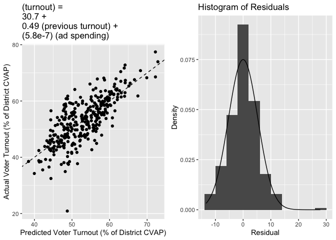
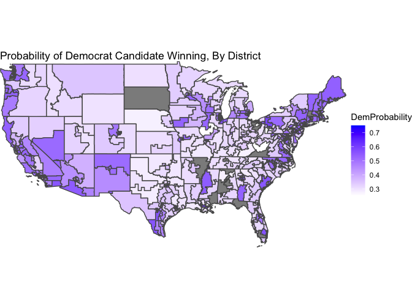
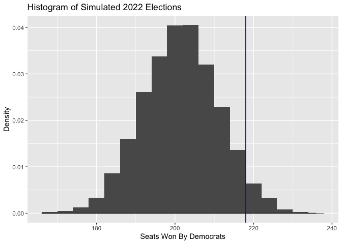

# Blog Post Six: The Ground Game

### October 19, 2022

[Back to Homepage](../../README.md)

[View the
Code](https://github.com/jrdelgado2018/GOV1347/blob/master/blogs/blog6/Blog%20Six.Rmd)

## Introduction

In this blog post, I will think carefully about how to incorporate voter
turnout into my model, and combine this analysis with my existing
findings about the economy, incumbency, and expert predictions. I will
also move from a linear model to a generalized linear model, forecasting
a binomial vote distribution for each district instead of a single point
estimate of Democrat vote share.

## Thinking About Turnout

As we saw [last
week](https://jrdelgado2018.github.io/GOV1347/blogs/blog5/Blog-Five.html),
the “air war” did not impact our predictive model very much, because the
coefficient on our advertisement spending data was very low. Our
interpretation of this was that it fell in line with findings from [by
Gerber et al.](https://www.jstor.org/stable/41480831) that
advertisements have have an effect that deteriorates almost completely
after one week.

We know, thanks to [Huber and
Arceneaux](https://www.jstor.org/stable/4620110), that campaign
advertisements do not generally mobilize voters to go to the polls when
they otherwise would have stayed home; rather, they subliminally
persuade voters to change how they approach the decision of who to vote
for. However, we also know, thanks to [Enos and
Fowler](https://www.cambridge.org/core/journals/political-science-research-and-methods/article/abs/aggregate-effects-of-largescale-campaigns-on-voter-turnout/20C500B0DE62227873FD24CB3555F779),
that the “ground game” legitimately *does* mobilize voters to get to the
polls when they otherwise would not have. The composition of the voter
pool likely impacts the result of an election, so we would like to
incorporate this information into our predictive models. Unfortunately,
we do not have access to detailed data about ground game operations on
the district level, like the number of field offices or campaign
employees. What we *do* have access to is somewhat robust data on
advertising spending, which we know correlates with ground game
activities.

So, I propose using campaign advertising spending as a proxy for ground
game activity, with which we can predict voter turnout. We want to
predict voter turnout as a first step since our ultimate goal is to
forecast the 2022 midterm elections, and we of course do not know what
voter turnout will look like on November 8th!

Below presents a simple regression model predicting the voter turnout
(as a percentage of the civilian voting age population of the district)
from the total campaign advertisement spending in the district (from all
parties), and from the voter turnout in the previous election. In this
case, by “previous election” I mean the election from four years ago, so
that midterm elections line up and presidential elections line up. This
is because voter turnout is much higher in presidential years, due to
the high stakes office being elected. Also, the campaign spending data
gives us information like the tone and purpose of each ad, which might
give us a clue about the style of the ground game used in this district,
but [Kalla and
Broockman](https://www.cambridge.org/core/journals/american-political-science-review/article/abs/minimal-persuasive-effects-of-campaign-contact-in-general-elections-evidence-from-49-field-experiments/753665A313C4AB433DBF7110299B7433)
find that the ground game does not persuade voters very effectively. So
the tone/purpose of the campaign in each district is not relevant for
our purposes - we only need to focus on the volume of the campaign. We
use the total spending in each district over the entire campaign, not a
transformation of it (e.g. its logarithm), because [Enos and
Fowler](https://www.cambridge.org/core/journals/political-science-research-and-methods/article/abs/aggregate-effects-of-largescale-campaigns-on-voter-turnout/20C500B0DE62227873FD24CB3555F779)
demonstrate that ground game efforts are approximately additive
(contrasting with [Gerber et
al.](https://www.jstor.org/stable/41480831)’s finding that the air war
is not).

    ## 
    ## Call:
    ## lm(formula = Turnout ~ TotalSpending + TurnoutPrev, data = df1)
    ## 
    ## Residuals:
    ##      Min       1Q   Median       3Q      Max 
    ## -27.8602  -3.0798   0.1149   2.8729  13.3524 
    ## 
    ## Coefficients:
    ##                Estimate Std. Error t value Pr(>|t|)    
    ## (Intercept)   3.068e+01  1.145e+00  26.801  < 2e-16 ***
    ## TotalSpending 5.776e-07  8.541e-08   6.763 6.48e-11 ***
    ## TurnoutPrev   4.937e-01  2.558e-02  19.295  < 2e-16 ***
    ## ---
    ## Signif. codes:  0 '***' 0.001 '**' 0.01 '*' 0.05 '.' 0.1 ' ' 1
    ## 
    ## Residual standard error: 5.318 on 319 degrees of freedom
    ##   (408 observations deleted due to missingness)
    ## Multiple R-squared:  0.5749, Adjusted R-squared:  0.5722 
    ## F-statistic: 215.7 on 2 and 319 DF,  p-value: < 2.2e-16

This model explains 57.5% of the variance in voter turnout, which is
fairly good - the scatterplot comparing predicted voter turnout with
actual voter turnout is pretty closely aligned with the dashed 45-degree
line. Moreover, our coefficient for advertisement spending is
statistically significant, and is large enough that it will affect our
model. Even though a coefficient on the order of 10−7 might
seem small, the mean advertisement spending in the data is roughly
2 × 107, quite large. According to our model, this level of
campaign spending would cause roughly a 1.2% increase in voter turnout
in the district, which is on the same order of magnitude of estimates of
the effect of the ground game that we see in the literature. This
validates our simple model.

Not only is predicting turnout important because we do not know what the
2022 turnout will look like, but our model gives us the voter turnout
that is *implied* by the ground game in the district. This is an
interpretation that we care about, since it allows us to measure the
campaign’s effect on the election (instead of the effect of some voters
waking up on Election Day and randomly deciding to go vote). So, in
training our generalized linear model, we will actually use this
estimate for voter turnout instead of the actual voter turnout, because
it allows us to learn about the effectiveness (or, lack thereof) of
campaigns.

## Model Update

Now, we will move on to updating our main predictive model for 2022. The
major update is moving from a linear model that predicts Democrat vote
share to a generalized linear model that predicts the probability of the
Democrat candidate’s success. The specific GLM we will use is a binomial
logistic model, where we assume that each voter casts his or her vote
independently of the other voters in a district, and the probability
that any single voter chooses the Democrat is a sigmoid transformation
of a linear combination of the predictors.

On to the predictors we will use. As we have done in previous weeks, we
will use the Democrat vote share in the previously observed election,
and as discussed above, we will use our campaign-based estimate for
voter turnout. However, we will allow the voter turnout predictor to
interact with the previous vote share predictor. This is because we care
about whether the additional voters will choose the Democrat or the
Republican, and our best guess for the proportion of additional voters
that will choose the Democrat is the proportion that did in the last
election. For the fundamentals, we will use the Q8 unemployment rate for
each state (as discussed [last
week](https://jrdelgado2018.github.io/GOV1347/blogs/blog5/Blog-Five.html)),
the average generic ballot poll support for Democrats in the two-months
leading up to the election, and flags for party incumbency and whether
the seat is open. Finally, we will include the expert predictions from
[Inside Elections](https://insideelections.com/ratings/house) in this
model, because they are a reputable forecaster and have an API from
which one can download predictions for all 435 districts going back to
2010. We transform their categorical rankings onto a numerical 1-9
scale, which assumes that the “distance” between adjacent categories is
relatively constant (this seems reasonable).

    ## 
    ## Call:
    ## glm(formula = cbind(DemVotes, RepVotes) ~ DemPctPrev + Interaction + 
    ##     DemPolls + DemIncumbent + code + is_open, family = binomial, 
    ##     data = df2)
    ## 
    ## Deviance Residuals: 
    ##      Min        1Q    Median        3Q       Max  
    ## -227.766   -39.321     4.386    38.892   201.031  
    ## 
    ## Coefficients:
    ##                    Estimate Std. Error z value Pr(>|z|)    
    ## (Intercept)      -4.687e+00  2.237e-02 -209.53   <2e-16 ***
    ## DemPctPrev        2.188e-02  6.594e-05  331.82   <2e-16 ***
    ## Interaction      -1.448e-04  1.142e-06 -126.78   <2e-16 ***
    ## DemPolls          7.993e+00  4.083e-02  195.78   <2e-16 ***
    ## DemIncumbentTRUE  3.613e-01  6.899e-04  523.77   <2e-16 ***
    ## code             -5.785e-02  9.522e-05 -607.56   <2e-16 ***
    ## is_open          -4.205e-02  5.574e-04  -75.44   <2e-16 ***
    ## ---
    ## Signif. codes:  0 '***' 0.001 '**' 0.01 '*' 0.05 '.' 0.1 ' ' 1
    ## 
    ## (Dispersion parameter for binomial family taken to be 1)
    ## 
    ##     Null deviance: 4559837  on 321  degrees of freedom
    ## Residual deviance: 1294615  on 315  degrees of freedom
    ## AIC: 1298791
    ## 
    ## Number of Fisher Scoring iterations: 3

All of the variables are significant in this model, but it turns out
that the statewide unemployment does *not* reduce the AIC by very much.
So, for the sake of parsimony, I exclude it. This lines up with our
discussion [last
week](https://jrdelgado2018.github.io/GOV1347/blogs/blog5/Blog-Five.html)),
that perhaps the instability we’ve seen in which measure of unemployment
is most predictive is indicative that it is a lower-level priority in
the minds of voters. Our model also interprets the effect of the
campaign, in that the sign of the interaction term is negative,
indicating that when more voters turn out, they tend to preferentially
vote Republican (beyond what the “baseline” voter turnout does). This is
unexpected, because conventional wisdom says that higher turnout usually
helps the Democrats. Perhaps, from this information, we might conclude
that Republicans tended to run more effective congressional campaigns
than Democrats did over the past decade.

The model has a McFadden’s R-squared of 72%, and exhibits a bootstrapped
out-of-sample estimate of the root mean squared error of around 6%. So,
we are well in-line with our prediction accuracy of previous weeks, and
have the added benefit of a model that fits the constraints of values
that can actually appear in an election (as opposed to an unbounded
linear regression model).

## 2022 Prediction

Now we will update our prediction for 2022. We have access to the Inside
Elections ratings, and the most recent generic ballot poll from
[FiveThirtyEight](https://projects.fivethirtyeight.com/polls/generic-ballot/).
The previous Democrat vote share, and the flags for party
incumbency/open seat we also know exactly. This means that we just have
to forecast turnout. We do this using the model we fit at the beginning
of this blog post, as well as the model we made [last
week](https://jrdelgado2018.github.io/GOV1347/blogs/blog5/Blog-Five.html)
that predicts ad spending in the next election from ad spending in the
previous election and incumbency. For the districts in which we do not
have any data on ad spending, we simply forecast that turnout will not
change from the previous election. Finally, in noncompetitive districts
(where either no Democrat or no Republican is running), we predict that
the unopposed candidate will win 100% of the time. In open seats for
which we have data missing, we predict a pure toss-up.

Below is a map of our district-level probabalistic predictions, where a
color closer to white represents the Democrat winning with low
probability, and a color closer to blue represents the Democrat winning
with high probability. For clarity of the color scale, uncontested
districts are not included in this map (because their probabilities are
either 0 or 1).

Finally, we can use this to form a final seat-share prediction. The sum
of our Democrat win probabilities tells us the expected seat share for
Democrats - the Democrats are predicted to win **202 seats**, or 46.4%.
We can also use simulation to show the distribution of Democrat seat
wins, in the below histogram (where the vertical line denotes a
majority).

