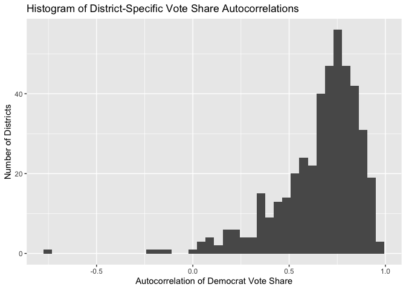
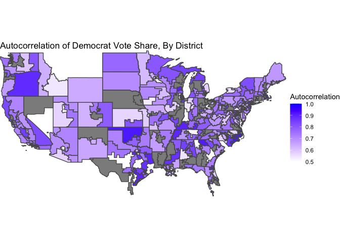
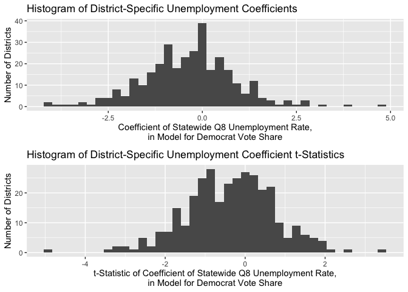
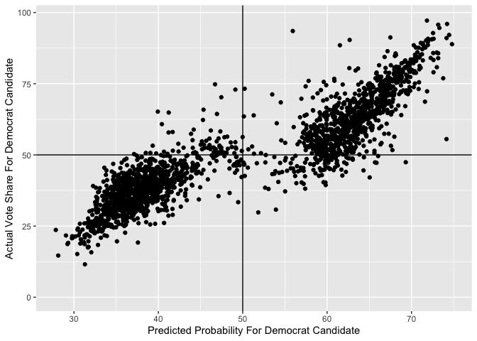
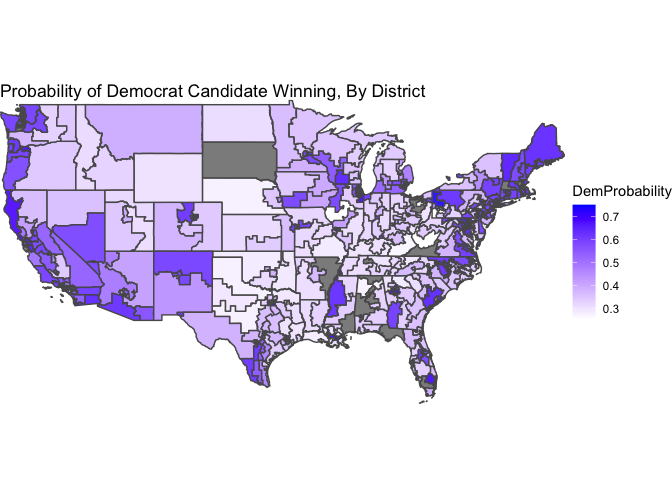
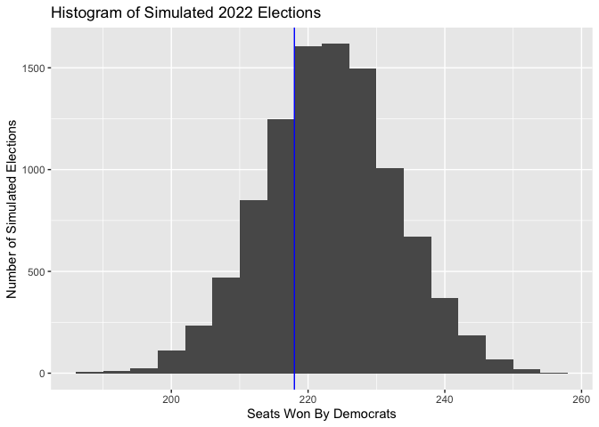

# Blog Post Seven: Pooled Models

### October 26, 2022

[Back to Homepage](../../README.md)

[View the
Code](https://github.com/jrdelgado2018/GOV1347/blob/master/blogs/blog7/Blog%20Seven.Rmd)

## Introduction

In this blog post, I will critically consider the modeling choice of
using one pooled model for all districts vs. individual models for each
district, before updating my prediction of the 2022 midterms.

## To Pool Or Not To Pool

There are advantages and disadvantages to the pooled model approach. A
pooled model uses data from all districts to fit one prediction function
that applies to all districts, so it essentially learns the
commonalities between districts. This means that it is less sensitive to
the idiosyncrasies that might be present between districts, so we have
to hope that the districts all respond to the predictors in a similar
manner. However, this additional assumption allows us to model
correlations *between* districts (which district-specific models do not
include), and it also allows us to be more efficient with our data usage
(since the same amount of data is sent to a single model instead of
getting split into 435 models).

On the other hand, an unpooled model uses data from one particular
district to fit a model that predicts outcomes for that particular
district. This means that it picks up on the specific patterns exhibited
by that district, but is reliant on a much smaller data set. If the data
set is too small, we might end up overfitting to the noise without
actually parsing out the true trend. However, if the data set is large
enough, we can learn about the specific behavior of this district
without getting “distracted” by what other districts tend to do. When we
have reason to believe that different districts behave quite
differently, this works in our favor.

[Last
week](https://jrdelgado2018.github.io/GOV1347/blogs/blog6/Blog-Six.html)
and in previous weeks, we have actually only considered pooled models.
We haven’t, though, made that choice with proper justification up to
this point. So, we will now investigate which factors are best to pool
and which are best to leave unpooled, before updating our prediction for
2022.

## Autocorrelation

One of the most predictive features in my previous models has been the
outcome of the previous election. This is for good reason - intuitively,
without any other information, a natural guess for what will happen in
an election is what happened in the most recent election. In our linear
models, the Democrat vote share of the previous election has a
coefficient that is related to (but not exactly equal to) the
“autocorrelation” of this variable - quantifying how well the previous
election predicts the next election. An autocorrelation closer to 1
means that the next election is perfectly determined by the previous
election, and an autocorrelation closer to 0 means that the next
election is completely unrelated to the previous election.

Our pooled models imply that the different districts have similar values
for this autocorrelation. In other words, that each district has the
same dependence on its previous election outcome. But is this grounded
in truth? To investigate, we will calculate the autocorrelation value
for each district, and then examine how spread out the resulting
distribution of autocorrelations is.

This distribution is pretty spread out! The majority of the
autocorrelation values are clustered around 0.75, but this clustering is
not very tight. Some districts have autocorrelations very close to 1,
some districts have autocorrelations very close to 0.5, and a handful of
districts have autocorrelations that are close to 0 or are even
negative! This means that our pooling assumption - that the different
districts respond similarly to this variable - is invalid. So, in this
model update, we will include the previous vote share in an unpooled
model.

At this point, might wonder if there are regional patterns in these
autocorrelations. That is to say, maybe the variation of these
autocorrelations exists on a larger regional scale. To satisfy this
curiosity, as a quick aside I map the autocorrelation value for each
district (ignoring those autocorrelations below 0.5 to make the color
scale more granular), in order to see if any regional patterns emerge.

The districts definitely tend to have a color similar to their
neighbors, but broad regions of the country do not seem to align in
general.

## The Economy

Measuring the effect of the state of the economy on election outcomes is
something we have grappled with for a while. We’ve seen great support
for the inclusion of this factor [in the
literature](https://www.jstor.org/stable/23357704), but more nebulous
results in our investigations when we moved the analysis of this factor
from the state level to the district level. Perhaps this happened
because different districts within each state have different
sensitivities to this factor, so it was inappropriate to use a pooled
model in this case. To investigate, I calculate the regression
coefficient for Q4 unemployment for each district, in a bivariate model
that includes Q8 unemployment and the district’s previous Democrat vote
share as independent variables. I also report the t-statistic for each
coefficient.

As we can see, the different districts have *wildly* different
coefficients, centered around an average coefficient of 0 (indicating no
effect for this variable!). Moreover, the vast majority of t-statistics
on these coefficients are between -2 and 2, indicating statistical
insignificance. The same results occur when we consider the Q7-Q8
percent change in unemployment. For this reason, we will exclude the
state of the economy as a factor in both our pooled and our unpooled
district-level models. In the future, though, we will think about ways
to incorporate the state-level models (that demonstrated a more
successful application of this variable) into our final prediction.

## The Case For The Other Variables

Another predictive feature of our previous models has been the results
of the generic ballot poll. We have pooled this variable across
districts in the past, but we have reason to believe that this choice
was unwarranted. The generic ballot represents the *average* voter, and
it does not make sense to assume (in a pooled model) that the different
districts are equally representative of the average voter! Some
districts skew much more liberal, and others skew much more
conservative, and we would expect these two cases to exhibit different
sensitivities to the generic ballot. So, due to this theoretical
consideration, we will include the generic ballot only in unpooled
models this week.

We also included in our models structural factors (like incumbency, the
party of the president, and the status of midterm vs. presidential
election) and expert ratings. We keep these structures in a pooled
model, due to practical limitations of our data. For many of the
districts for which our data on these factors is complete, there is not
very much variation in these variables. A district will tend to have a
similar expert rating election-to-election and a similar incumbent
party, for example. So, in isolating each district for an individual
model, we would likely not have the variation necessary to tease out
robust coefficient estimates. So, we resort to a pooled model, where we
can take advantage of *all* of our data to learn the similarities
between districts with respect to these factors.

## Model Update and 2022 Prediction

So, we are now ready to update our model. We will consider a pooled
model consisting of the Inside Elections rating and election structural
factors as predictors, and individual models consisting of the
district’s previous vote share and the generic ballot as predictors. To
make our final prediction, we will ensemble the two models by taking the
simple average of the predictions. In the future, we will read up on
more sophisticated ways to choose the ensemble weights!

Here is a scatter plot comparing the Democrat’s predicted success
probability given by the GLM model to the actual vote share they
achieved. This model is pretty successful - the two main groups of
points are where both the success probability and the vote share are
above 50%, and where both the success probability and the vote share are
below 50%. Only for a few points does the election outcome disagree with
the success probability.

I also calculate a bootstrapped estimate of the out-of-sample
misclassification rate, using only 10 bootstrapped samples (since the
fitting procedure takes very long). The estimate for the
misclassification rate is just under 9%, which is pretty low! This means
that we expect our model to correctly predict the win/lose result of 91%
of districts.

Now, I can update my prediction for 2022. In the same manner as [last
week](https://jrdelgado2018.github.io/GOV1347/blogs/blog6/Blog-Six.html),
I get the most currently available values for today’s data. I use the
same heuristics for noncompetitive districts, assuming that the
unopposed candidate has a success probability of 100%.

Here is a map of the predicted success probabilities, by district. The
grey districts are uncontested, and excluded so that the color scale can
be more granular.

For the final seat-share prediction, this model has Democrats winning an
expected value of **223 seats**, or 51%. Our expectation of the
performance of Democrats has *increased* compared to last week. Is this
due to our inclusion of unpooled models? More likely, it is due to our
exclusion of campaigning and turnout, which we concluded [last
week](https://jrdelgado2018.github.io/GOV1347/blogs/blog6/Blog-Six.html)
tended to actually give Republican congressional candidates the
advantage. So, in the future, we should think about ways to bring this
data back into our models even though it is widely missing.

We can again understand the uncertainty of our prediction via
simulation. Below is a histogram of the Democrat performance in each
simulated election, with a vertical line denoting a majority of seats.

