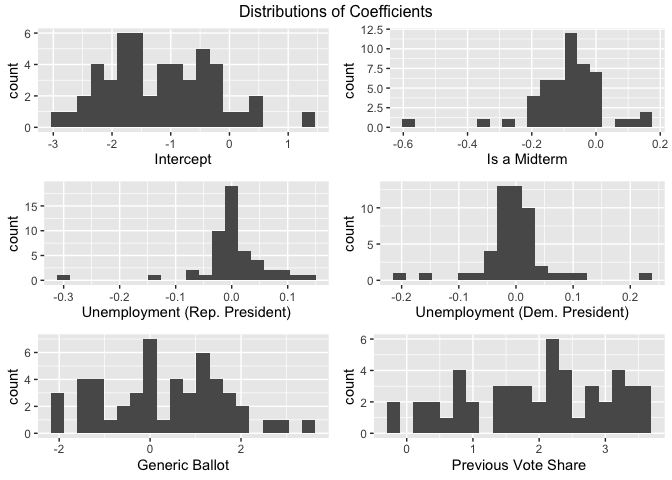
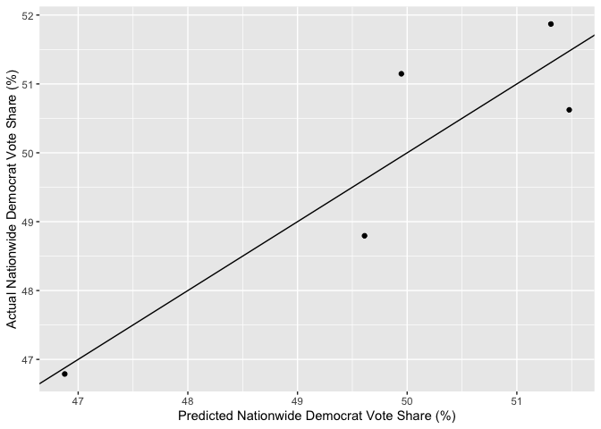
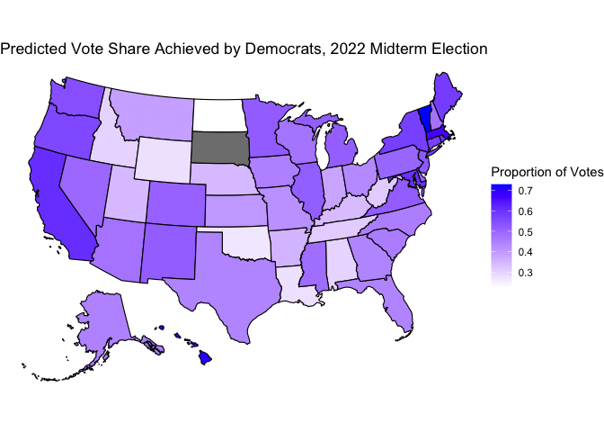
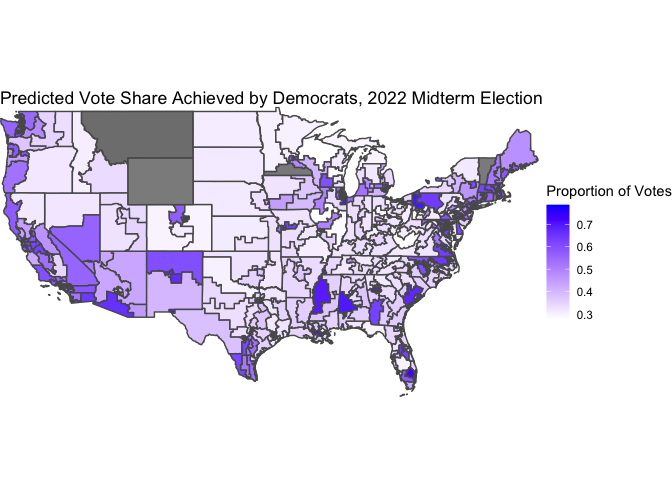

# Blog Post Eight: Final Midterm Prediction

### November 7, 2022

[Back to Homepage](../../README.md)

[View the
Code](https://github.com/jrdelgado2018/GOV1347/blob/master/blogs/blog8/Blog%20Eight.Rmd)

## Introduction

In this *final* blog post, I will present my final model for the 2022
midterm elections and its predictions for the composition of the House
of Representatives.

## Model Specification

Informed by all the work we have done over the past two months, our
model will consist of two pieces.

The first piece will be an unpooled statewide model (so one model for
each state) that predicts the Democrat’s vote share based on the
economy, the generic ballot, the state’s previous vote share for
Democrats, and structural election factors. We do not pool data across
states because, [as we saw last
week,](https://jrdelgado2018.github.io/GOV1347/blogs/blog7/Blog-Seven.html)
there is evidence of variation in the autocorrelation of different
region’s vote shares. We go back to including the economy (as measured
by the statewide unemployment rate) in this model because there is
strong evidence for this variable’s impact [in the
literature,](https://www.jstor.org/stable/23357704) and it had
legitimate predictive power [our earlier state-level
models.](https://jrdelgado2018.github.io/GOV1347/blogs/blog2/Blog-Two.html)

The second piece will be a pooled district-level model that predicts the
Democrat’s vote share based on expert ratings from [Inside
Elections](https://insideelections.com/ratings/house) and the [Cook
Political
Report](https://www.cookpolitical.com/ratings/house-race-ratings),
demographic data, the incumbent’s ideological positioning as measured by
DW-NOMINATE scores, and structural election factors. We pool this data
because we expect these variables to affect all the districts
similarly - for example, experts tune their ratings specifically to be
consistent across districts, and there is strong evidence [in the
literature](https://www.cambridge.org/core/journals/american-political-science-review/article/abs/out-of-step-out-of-office-electoral-accountability-and-house-members-voting/A5E4346ED9DD671DEFC6EE48064A0812)
that the incumbent’s ideological positioning has a similar electoral
effect across districts. Pooling also has the benefit of being more
robust to redistricting, as we will end up with one model that applies
to all districts, even those that were newly created after the 2020
census.

Finally, we will combine our two models via regression stacking,
producing an ensemble model that will provide our final vote share
prediction. We ultimately predict vote share, rather than seat share, to
follow [Jennifer Victor’s advice for effective
presentation](https://www.cambridge.org/core/journals/ps-political-science-and-politics/article/abs/lets-be-honest-about-election-forecasting/A573B2560D0B9CEB408611F05A9446FC),
and because in our previous work we did not see a large discrepancy in
accuracy when predicting one versus the other.

## Statewide Models

### Formulation

Predictions of this model will follow the form

*V̂**i* = logit(*β*0, *i* + (*β*1, *i**X*1, *i*+*β*2, *i*)*X*2, *i* + *β*3, *i**X*3, *i* + *β*4, *i**X*4, *i* + *β*5, *i**X*5, *i*)

Here, *V̂**i* is the predicted vote share (for Democrats) in
the *i*th state, each *β* is a coefficient, and each *X* is a variable.
The subscript *i* on all the coefficients denote that this model allows
each state to have its own coefficient. *X*1 is an indicator
for whether the sitting president is a Democrat, *X*2 is the
Q8 unemployment rate for the state, *X*3 is the results of
the generic ballot poll (averaged over the month preceding the
election), *X*4 is the state’s previous vote share for the
Democrat candidate, and *X*5 is an indicator for whether the
election is a midterm or not (where the sign indicates whether the
sitting president is a Democrat or a Republican, since voters tend to
punish the *incumbent* in midterms, not a particular party). This is
essentially an unpooled version of [our earliest
model](https://jrdelgado2018.github.io/GOV1347/blogs/blog3/Blog-Three.html),
with an added flag indicating whether it is a midterm year or a
presidential year (which we saw proved useful in [our most recent
model](https://jrdelgado2018.github.io/GOV1347/blogs/blog6/Blog-Six.html)).

### Fit

We fit the models, and plot distributions of the coefficients to get a
general sense of how predictions are made.

The magnitudes of the coefficients are difficult to interpret, since the
variables all have different units and predictions are made via a logit
function rather than a simple linear function. However, we *can* easily
interpret the sign of the coefficients. Almost all of the models have a
negative coefficient for the midterm flag, indicating that Democrats
tend to receive fewer votes when it is a midterm and they have the
presidency (and more votes when it is a midterm and a Republican has the
presidency). Most of the models have a positive coefficient for the
unemployment term when a Republican has the presidency, showing that
voters turn to Democrats in periods of high unemployment because this is
an issue they “own.” However, when a Democrat has the presidency, most
of the coefficients shift to the left, showing that voters are less apt
to “reward” Democrats for high unemployment when one is already
president. There is a clean divide in the signs of the sensitivities to
the generic ballot, indicating that some states are more conservative
than the average voter and some states are more liberal than the average
voter. Finally, almost all the models have positive sensitivity to their
previous vote share, with some states being very sensitive to it and
others being less so. For almost every model, all of the coefficients
are statistically different from zero at a five percent significance
level, which justifies this model.

## District-Level Model

### Formulation

Predictions of this model will follow the form

*V̂**i* = logit(*β*0 + *β*1*X*1, *i* + *β*2*X*2, *i* + *β*3*X*3, *i* + *β*4*X*4, *i* + *β*5*X*5, *i* + *β*6*X*6, *i* + *β*7*X*7, *i*)

Here, *V̂**i* is again the predicted vote share (for
Democrats) in the *i*th district, each *β* is a coefficient, and each
*X* is a variable. Notice that this time, the coefficients do not have a
subscript *i*, so all districts share the same coefficients.
*X*1 is the average rating from Inside Elections and the Cook
Political Report (coded on a numerical scale), *X*2 is the
proportion of the district below the age of 30, *X*3 is the
proportion of the district that is female, *X*4 is the
proportion of the district that is black or hispanic, *X*5 is
the incumbent’s DW-NOMINATE score (the first dimension), *X*6
is a flag for the incumbency status of the seat (where the sign codes
for Democrat versus Republican), and *X*7 is the same flag
from the earlier model detailing the midterm status of the election and
the party of the president.

### Fit

We fit the models, and report the coefficients along with standard
errors and p-values.

    ## 
    ## Call:
    ## glm(formula = cbind(DemVotes, RepVotes) ~ Experts + `20_29` + 
    ##     female + black_or_latino + nominate_dim1 + Incumbent + MidtermFlag, 
    ##     family = binomial, data = pooled_df)
    ## 
    ## Deviance Residuals: 
    ##      Min        1Q    Median        3Q       Max  
    ## -265.955   -51.968     1.303    47.671   299.987  
    ## 
    ## Coefficients:
    ##                   Estimate Std. Error z value Pr(>|z|)    
    ## (Intercept)     -4.310e+00  5.110e-03 -843.50   <2e-16 ***
    ## Experts          1.036e-01  9.152e-05 1132.41   <2e-16 ***
    ## `20_29`          1.727e+00  3.729e-03  463.20   <2e-16 ***
    ## female           7.669e+00  9.545e-03  803.43   <2e-16 ***
    ## black_or_latino  4.281e-01  6.433e-04  665.54   <2e-16 ***
    ## nominate_dim1   -4.073e-01  5.231e-04 -778.55   <2e-16 ***
    ## Incumbent       -5.781e-03  2.551e-04  -22.66   <2e-16 ***
    ## MidtermFlag     -7.459e-02  1.654e-04 -451.06   <2e-16 ***
    ## ---
    ## Signif. codes:  0 '***' 0.001 '**' 0.01 '*' 0.05 '.' 0.1 ' ' 1
    ## 
    ## (Dispersion parameter for binomial family taken to be 1)
    ## 
    ##     Null deviance: 59701388  on 1869  degrees of freedom
    ## Residual deviance: 10676285  on 1862  degrees of freedom
    ## AIC: 10700241
    ## 
    ## Number of Fisher Scoring iterations: 4

Again, we can much more easily interpret the signs of the coefficients
than their magnitudes. The ratings of experts has a positive
coefficient, which means that a district tends to see more votes for the
Democrat when experts give it a stronger rating in favor of the
Democrat. Each of the demographic categories we included has a positive
sign, validating that (as we might have expected) these demographics
tend to turn out more for Democrats than for Republicans. Between the
categories, we actually *can* interpret the signs of the coefficients,
because those three variables are all on the same scale - so we see that
the Democrat’s vote share is most sensitive to the proportion of female
voters, followed by the proportion of young voters, followed by the
proportion of black and hispanic voters. The incumbent’s NOMINATE score
has a negative coefficient, meaning that the Democrat gets more votes
when the incumbent is more liberal and fewer votes when the incumbent is
more conservative. The coefficient for the party of the incumbent is
negative (but much smaller than the other coefficients), meaning that
the Democrat gets slightly fewer votes when the incumbent is a Democrat
and slightly more votes when the incumbent is a Republican. This is
initially puzzling, but it seems that this coefficient is really
measuring “regression to the mean,” as variables like the expert ratings
and the incumbent’s NOMINATE score already implicitly account for the
incumbency advantage. Finally, we again see that Democrats tend to
receive fewer votes when it is a midterm and they have the presidency
(and more votes when it is a midterm and a Republican has the
presidency). All the coefficients are statistically significant,
providing one justification for this model.

## Final Ensemble Model and 2022 Prediction

### Formulation

With the two component models in place, we are ready to specify how our
final predictions will be made. The final prediction will take the form

*V̂* = *α*0 + *α*unpooledSUMstates *i*(*p**i* *V̂*unpooled, *i*) + *α*pooledMEANdistricts *i*(*V̂*pooled, *i*)

Again, the *V̂*’s represent predicted vote shares for the Democrats, with
the left-hand side being a nationwide vote share prediction. The *α*’s
represent the ensembling weights, where the pooled model gets one weight
and the unpooled model gets another weight. To calculate the nationwide
prediction of the unpooled model, we calculate the average prediction
across all states, weighted by the state population (according to the
2020 census). To calculate the nationwide prediction of the pooled
model, we calculate the (unweighted) average prediction across all
districts, which is reasonable because all districts have similar
populations. This method of calculating a final prediction assumes that,
across different states and districts, the proportion of eligible voters
who turn out to vote is roughly the same. This is likely not an *exact*
reflection of reality, but it should be close enough that a more nuanced
calculation would make our model unnecessarily complicated.

### Fit

To fit the *α*’s, we treat them as coefficients that we would like to
learn via OLS (this is called “regression stacking”).

The fitted values are *α*0 = 0.09,
*α*unpooled =  − 0.3, and *α*pooled = 1.1. This is
saying that the district-level model has a prediction that fluctuates
more than the state-level models (which makes sense since the former is
more granular than the latter). So, we “overpredict” with the
district-level model, and then walk that prediction back using the
state-level models.

### Diagnostics

This model has an R-squared of 81%, meaning that we are able to explain
81% of the variation in the nationwide vote share attained by Democrats
using this model. This is higher than any R-squared we had been able to
achieve previously, which is exciting!

Here is a plot comparing the actual Democrat vote share to the predicted
Democrat vote share in the five elections from the past decade (2012,
2014, 2016, 2018, and 2020), along with the 45-degree line for
reference. All of the data points are very close to the line - within a
vertical distance of 1 percentage point of the vote.

Using “leave one out” cross-validation, we can compute an out-of-sample
estimate of the mean absolute prediction error. We find a mean absolute
error of roughly 0.01, which means that our model will, on average,
deviate from the true two-party vote share won by Democrats by around
one percentage points. Expressed in terms of squared error instead of
absolute error, the out-of-sample estimate for root-mean squared error
is roughly two percentage points. Those are sizable margins, but they
are lower than the other out-of-sample margins of error we encountered
in our earlier work, which is also exciting!

### 2022 Prediction

After all this, our **final** prediction for the 2022 midterm election
is for **Democrats to win 49.18% of the nationwide two-party vote
share.** To form a 95% prediction interval around this prediction, we
calculate the standard error for each model and then apply the ensemble
weights. The resulting prediction interval has Democrats winning between
49.15% and 49.21% of the nationwide two-party vote share. This is a very
narrow predictive interval, and does not reflect the out-of-sample mean
absolute error that we observed earlier. The problem here is described
by
[FiveThirtyEight](https://fivethirtyeight.com/methodology/how-fivethirtyeights-house-and-senate-models-work/) -
we calculate standard errors as if the districts/states are independent
of each other, but this is a very bad approximation of reality. In real
life, the errors are quite correlated, which results in a much larger
standard error than our calculation implies. This does not change the
point estimate of our model, but it is a limitation that we must keep in
mind when we interpret our accuracy post-election!

In an “appendix” section below, I include maps that visualize the
individual predictions of the two models.

Below is a map of the statewide predictions (from the unpooled models).
South Dakota has an uncontested election, so we do not include it on
this map because our model does not apply to uncontested elections.

Below is a map of the district predictions (from the pooled model). The
few grey districts (around 5) had data missing, so we do not include
them on this map for simplicity.

